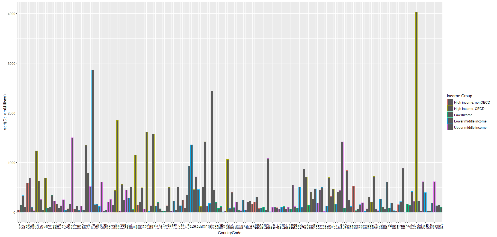

# CaseStudy1
Kyle Killion  
June 13, 2016  


##Read the Gross Domestic Product and Educational data for the 190 ranked countries in this raw data set


```r
dataGDP <- read.csv("https://d396qusza40orc.cloudfront.net/getdata%2Fdata%2FGDP.csv", 
         stringsAsFactors = FALSE,
         header=FALSE)


dataEd <- read.csv('https://d396qusza40orc.cloudfront.net/getdata%2Fdata%2FEDSTATS_Country.csv',
                 stringsAsFactors = FALSE,
                 header = TRUE)
```

##Trim the edges of the DataSet for a uniform Set. Also, here we give the Data Columns a certain type so the computer knows how to handle the values
*Used function gsub() to correctly read in data type for "DollarsMillions"*


```r
#Set the 2-alpha.code column name

names(dataEd)[28] <- '2-alpha.code'


# Trim the edges of the DataSet for a uniform Set
# Also, write Column names

dataGDP <- dataGDP[6:223, c(1,2,4,5)]
names(dataGDP) <- c('CountryCode','Rank','Country','DollarsMillions')


# Data Type the Columns for what they represent

dataGDP$CountryCode <- as.character(dataGDP$CountryCode)
dataGDP$Rank <- as.integer(dataGDP$Rank)
dataGDP$DollarsMillions <- as.integer(gsub(",","", dataGDP$DollarsMillions))
```

```
## Warning: NAs introduced by coercion
```

```r
dataGDP$Country <- as.character(dataGDP$Country)
```


### Merge the two data sets on the vector CountryCode


```r
# Merge the two data sets GDP and Education then provide a summary of the merge

bigData <- merge(dataGDP, dataEd, by='CountryCode')
summary(bigData)
```

```
##  CountryCode             Rank          Country          DollarsMillions   
##  Length:211         Min.   :  1.00   Length:211         Min.   :      40  
##  Class :character   1st Qu.: 48.00   Class :character   1st Qu.:    7005  
##  Mode  :character   Median : 95.00   Mode  :character   Median :   28308  
##                     Mean   : 95.31                      Mean   :  758864  
##                     3rd Qu.:143.00                      3rd Qu.:  209157  
##                     Max.   :190.00                      Max.   :72440449  
##                     NA's   :22                          NA's   :21        
##   Long.Name         Income.Group          Region         
##  Length:211         Length:211         Length:211        
##  Class :character   Class :character   Class :character  
##  Mode  :character   Mode  :character   Mode  :character  
##                                                          
##                                                          
##                                                          
##                                                          
##  Lending.category   Other.groups       Currency.Unit     
##  Length:211         Length:211         Length:211        
##  Class :character   Class :character   Class :character  
##  Mode  :character   Mode  :character   Mode  :character  
##                                                          
##                                                          
##                                                          
##                                                          
##  Latest.population.census Latest.household.survey Special.Notes     
##  Length:211               Length:211              Length:211        
##  Class :character         Class :character        Class :character  
##  Mode  :character         Mode  :character        Mode  :character  
##                                                                     
##                                                                     
##                                                                     
##                                                                     
##  National.accounts.base.year National.accounts.reference.year
##  Length:211                  Min.   :1987                    
##  Class :character            1st Qu.:1996                    
##  Mode  :character            Median :2000                    
##                              Mean   :1999                    
##                              3rd Qu.:2002                    
##                              Max.   :2007                    
##                              NA's   :174                     
##  System.of.National.Accounts SNA.price.valuation
##  Min.   :1993                Length:211         
##  1st Qu.:1993                Class :character   
##  Median :1993                Mode  :character   
##  Mean   :1993                                   
##  3rd Qu.:1993                                   
##  Max.   :1993                                   
##  NA's   :126                                    
##  Alternative.conversion.factor PPP.survey.year
##  Length:211                    Min.   :2005   
##  Class :character              1st Qu.:2005   
##  Mode  :character              Median :2005   
##                                Mean   :2005   
##                                3rd Qu.:2005   
##                                Max.   :2005   
##                                NA's   :66     
##  Balance.of.Payments.Manual.in.use External.debt.Reporting.status
##  Length:211                        Length:211                    
##  Class :character                  Class :character              
##  Mode  :character                  Mode  :character              
##                                                                  
##                                                                  
##                                                                  
##                                                                  
##  System.of.trade    Government.Accounting.concept
##  Length:211         Length:211                   
##  Class :character   Class :character             
##  Mode  :character   Mode  :character             
##                                                  
##                                                  
##                                                  
##                                                  
##  IMF.data.dissemination.standard
##  Length:211                     
##  Class :character               
##  Mode  :character               
##                                 
##                                 
##                                 
##                                 
##  Source.of.most.recent.Income.and.expenditure.data
##  Length:211                                       
##  Class :character                                 
##  Mode  :character                                 
##                                                   
##                                                   
##                                                   
##                                                   
##  Vital.registration.complete Latest.agricultural.census
##  Length:211                  Length:211                
##  Class :character            Class :character          
##  Mode  :character            Mode  :character          
##                                                        
##                                                        
##                                                        
##                                                        
##  Latest.industrial.data Latest.trade.data Latest.water.withdrawal.data
##  Min.   :1995           Min.   :1975      Min.   :1990                
##  1st Qu.:2002           1st Qu.:2007      1st Qu.:2000                
##  Median :2004           Median :2008      Median :2000                
##  Mean   :2003           Mean   :2007      Mean   :2001                
##  3rd Qu.:2005           3rd Qu.:2008      3rd Qu.:2000                
##  Max.   :2006           Max.   :2008      Max.   :2006                
##  NA's   :116            NA's   :23        NA's   :59                  
##  2-alpha.code        WB.2.code          Table.Name       
##  Length:211         Length:211         Length:211        
##  Class :character   Class :character   Class :character  
##  Mode  :character   Mode  :character   Mode  :character  
##                                                          
##                                                          
##                                                          
##                                                          
##   Short.Name       
##  Length:211        
##  Class :character  
##  Mode  :character  
##                    
##                    
##                    
## 
```

##The following code looks to see how many Country Code IDs Match and count up the NA's within the data set by Column and Total.


```r
#See how many IDs match

print(paste("ID NO Match:", sum(is.na(bigData$CountryCode))))
```

```
## [1] "ID NO Match: 0"
```

```r
# Count the number of NA's within the DataSet

colSums(is.na(bigData))
```

```
##                                       CountryCode 
##                                                 0 
##                                              Rank 
##                                                22 
##                                           Country 
##                                                 0 
##                                   DollarsMillions 
##                                                21 
##                                         Long.Name 
##                                                 0 
##                                      Income.Group 
##                                                 0 
##                                            Region 
##                                                 0 
##                                  Lending.category 
##                                                 0 
##                                      Other.groups 
##                                                 0 
##                                     Currency.Unit 
##                                                 0 
##                          Latest.population.census 
##                                                 0 
##                           Latest.household.survey 
##                                                 0 
##                                     Special.Notes 
##                                                 0 
##                       National.accounts.base.year 
##                                                 0 
##                  National.accounts.reference.year 
##                                               174 
##                       System.of.National.Accounts 
##                                               126 
##                               SNA.price.valuation 
##                                                 0 
##                     Alternative.conversion.factor 
##                                                 0 
##                                   PPP.survey.year 
##                                                66 
##                 Balance.of.Payments.Manual.in.use 
##                                                 0 
##                    External.debt.Reporting.status 
##                                                 0 
##                                   System.of.trade 
##                                                 0 
##                     Government.Accounting.concept 
##                                                 0 
##                   IMF.data.dissemination.standard 
##                                                 0 
## Source.of.most.recent.Income.and.expenditure.data 
##                                                 0 
##                       Vital.registration.complete 
##                                                 0 
##                        Latest.agricultural.census 
##                                                 0 
##                            Latest.industrial.data 
##                                               116 
##                                 Latest.trade.data 
##                                                23 
##                      Latest.water.withdrawal.data 
##                                                59 
##                                      2-alpha.code 
##                                                 1 
##                                         WB.2.code 
##                                                 1 
##                                        Table.Name 
##                                                 0 
##                                        Short.Name 
##                                                 0
```

```r
# In Total NA's

print(paste("Total NA:", table(is.na(bigData))[2]))
```

```
## [1] "Total NA: 609"
```


###By sorting the Data set in decreasing order, we are able to find the 13th country from the last. Then group the data into Income Groups 
###and get the Average Rank for each. 


```r
# Sort the data frame in ascending order by GDP rank 
# (so United States is last)

index <- with(bigData, order(Rank, decreasing = TRUE))
heyo <- bigData[index,][c('Rank','Country')]
heyo[13:13,]
```

```
##     Rank             Country
## 102  178 St. Kitts and Nevis
```

```r
#Group the Income.Group column and then get the Average Rank of each

aggregate(Rank ~ Income.Group, bigData, mean)
```

```
##           Income.Group      Rank
## 1 High income: nonOECD  91.91304
## 2    High income: OECD  32.96667
## 3           Low income 133.72973
## 4  Lower middle income 107.70370
## 5  Upper middle income  92.13333
```


##Below I simplify the Data into only the variables we need to make it easier


```r
# Make Another DataFrame to simplify the Data Set for just Information we need

bigData2 <- na.omit(bigData[c('CountryCode','Rank',
                                'Country','DollarsMillions',
                                'Income.Group')])
```

##This is a BarPlot all of the countries using ggplot2 and grouping them by Income Group
*I took the square root of GDP "DollarsMillions" to transform the data*


```r
#Using Simplified Data Frame, conduct a Barplot and use sqrt() function to transform DollarsMillions

library(ggplot2)
ggplot(data=bigData2,
       aes(x=CountryCode, y=sqrt(DollarsMillions), group=Income.Group,
           colour = Income.Group))+
  theme(axis.text.x  = element_text(angle=-270, hjust=0.5, size=6,colour="black")) +
  geom_bar(stat="identity")
```

<!-- -->

*United States showing the max*
*High Income: OECD group showing on average a Higher GDP*


###Now we create a new column that cuts the Data into Categories based on Rank into 5 slices.
###Then, we look to see how many countries are in the __Lower Middle Income__ but among the 38 nations with the highest GDP


```r
# Make a new column and Cut the DataFrame. Then Cross-Classify the Income Groups to see how many 
# countries are in the Lower middle income but among the 38 nations with highest GDP

bigData2$Bins <- cut(bigData2$Rank, breaks=5)
print(table(bigData2$Income.Group, bigData2$Bins))
```

```
##                       
##                        (0.811,38.8] (38.8,76.6] (76.6,114] (114,152]
##   High income: nonOECD            4           5          8         4
##   High income: OECD              18          10          1         1
##   Low income                      0           1          9        16
##   Lower middle income             5          13         12         8
##   Upper middle income            11           9          8         8
##                       
##                        (152,190]
##   High income: nonOECD         2
##   High income: OECD            0
##   Low income                  11
##   Lower middle income         16
##   Upper middle income          9
```

```r
print(paste("Lower Middle Income in top 38 GDP:", table(bigData2$Income.Group, bigData2$Bins)[4]))
```

```
## [1] "Lower Middle Income in top 38 GDP: 5"
```

#Conclusion
_____
My main observations were that High Income: OECD Countries showed a consistent High GDP amongst the group as opposed to the nonOECD countries. Actually, there were more higher ranked GDP in 'Upper Middle Income' countries than there were in High Income: nonOECD countries.
